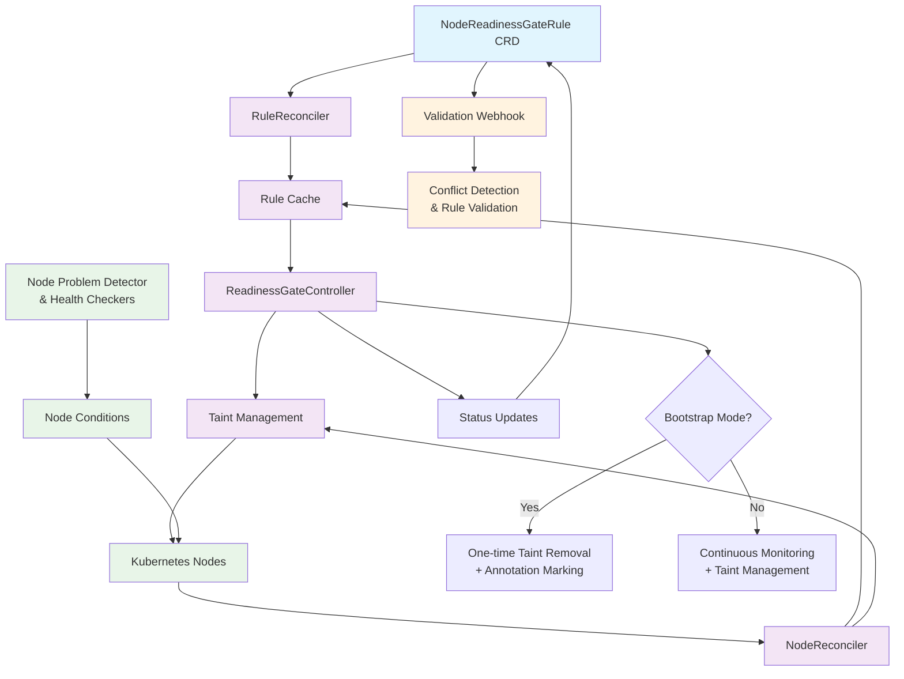

## Architecture

```
┌─────────────────┐    ┌──────────────────┐    ┌─────────────────┐
│ NodeReadiness   │    │ ReadinessGate    │    │ Validation      │
│ GateRule CRD    │────▶ Controller       │    │ Webhook         │
└─────────────────┘    └──────────────────┘    └─────────────────┘
                                │                       │
                                ▼                       │
                       ┌─────────────────┐              │
                       │ Node Taints     │              │
                       │ Management      │              │
                       └─────────────────┘              │
                                │                       │
                                ▼                       ▼
                       ┌─────────────────┐    ┌─────────────────┐
                       │ Kubernetes      │    │ Rule Conflict   │
                       │ Nodes           │    │ Detection       │
                       └─────────────────┘    └─────────────────┘

```

Detailed Flow:



### Core Components

#### 1. NodeReadinessGateRule CRD
- Defines rules mapping multiple node conditions to a single taint
- Supports bootstrap-only and continuous enforcement modes
- Allows node selector targeting and grace periods

#### 2. ReadinessGateController
- **RuleReconciler**: Processes rule changes and updates internal cache
- **NodeReconciler**: Handles node condition changes and evaluates applicable rules
- Manages taint addition/removal based on condition satisfaction

#### 3. [WIP] Validation Webhook
- Prevents conflicting rules (same taint key with overlapping node selectors)
- Validates rule specifications and required fields
- Ensures system consistency and prevents misconfigurations

#### 4. Integration with Node Problem Detector (NPD)
Works seamlessly with NPD or any system that sets node conditions:
- NPD plugins update node conditions (e.g., `example.io/CNIReady`)
- Controller watches condition changes and evaluates rules
- Supports custom conditions from any component